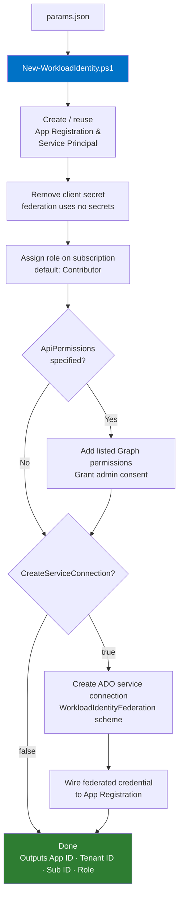

# azure-workload-identity

PowerShell automation for creating Entra ID app registrations with workload identity federation for Azure DevOps service connections. Follows the principle of least privilege — `Contributor` is the default role and no API permissions are added unless explicitly listed.

## Overview

Workload identity federation lets Azure DevOps pipelines authenticate to Azure without client secrets. The pipeline exchanges a short-lived OIDC token for an Azure access token using a federated credential on the app registration.



## Prerequisites

- PowerShell 7+
- Az PowerShell module: `Install-Module Az`
- Azure CLI: required only if `ApiPermissions` is non-empty (admin consent step)
- An active Az context: `Connect-AzAccount`
- **For service connection creation:** Project Collection Administrator in the target ADO org

## Usage

1. Copy `config/example.json` and populate your entries:

```json
[
    {
        "SubscriptionName": "sub-prod-myapp-01",
        "ServicePrincipalName": "app-myapp-devops",
        "Role": "Contributor",
        "ApiPermissions": [],
        "CreateServiceConnection": "true",
        "OrgName": "my-ado-org",
        "ProjectName": "My Project"
    }
]
```

2. Run:

```powershell
.\New-WorkloadIdentity.ps1 -ParamsFile 'config\my-params.json'
```

Add `-Verbose` to see each step as it runs. Multiple entries are supported — one app registration per entry.

---

## Params file schema

| Field | Required | Default | Description |
|---|---|---|---|
| `SubscriptionName` | Yes | — | Display name of the Azure subscription |
| `ServicePrincipalName` | No | `app-<SubscriptionName>-devops` | Name for the app registration and service principal |
| `Role` | No | `Contributor` | Azure RBAC role to assign on the subscription |
| `ApiPermissions` | No | `[]` | Microsoft Graph permissions to add (see below) |
| `CreateServiceConnection` | Yes | — | `"true"` or `"false"` |
| `OrgName` | If `CreateServiceConnection=true` | — | ADO org name (`dev.azure.com/<OrgName>`) |
| `ProjectName` | If `CreateServiceConnection=true` | — | ADO project name |

---

## Principle of least privilege

### Choosing a role

| Role | Use when |
|---|---|
| `Contributor` | Pipeline deploys resources but does not assign roles. **Default.** |
| `User Access Administrator` | Pipeline creates role assignments (e.g. assigns managed identity permissions). Use with `Contributor` via two entries, or use `Owner`. |
| `Owner` | Pipeline needs both deploy and role assignment rights. Prefer `Contributor` + `User Access Administrator` where possible. |
| Custom role | Restrict to specific resource providers or actions. Specify the exact role definition name. |

### API permissions

No Graph permissions are added by default. Only add what your pipeline explicitly needs.

Common permissions (add to `ApiPermissions` array):

```json
"ApiPermissions": [
    {
        "Name": "Directory.Read.All",
        "ApiId": "00000003-0000-0000-c000-000000000000",
        "PermissionId": "7ab1d382-f21e-4acd-a863-ba3e13f7da61",
        "Type": "Role"
    },
    {
        "Name": "Group.Read.All",
        "ApiId": "00000003-0000-0000-c000-000000000000",
        "PermissionId": "5b567255-7703-4780-807c-7be8301ae99b",
        "Type": "Role"
    }
]
```

| Permission | When you need it |
|---|---|
| `Group.Read.All` | Pipeline reads Entra ID group membership |
| `Directory.Read.All` | Pipeline reads broader directory data (users, apps, groups) |
| `Application.Read.All` | Pipeline reads app registrations |

> **Admin consent is only requested when `ApiPermissions` is non-empty.** This keeps runs that don't need Graph permissions faster and reduces blast radius.

---

## What gets created

For each entry in the params file:

| Resource | Name | Notes |
|---|---|---|
| App registration & service principal | `ServicePrincipalName` | Reused if it already exists |
| Role assignment | `Role` on `/subscriptions/<id>` | Skipped if already assigned |
| API permissions | Only those listed in `ApiPermissions` | Nothing added by default |
| ADO service connection | `conn-<ServicePrincipalName>` | Subscription scope |
| Federated credential | `AzureDevOps` on the app registration | Wired to the service connection issuer |

---

## Modules

### `modules/Authentication.ps1`

| Function | Description |
|---|---|
| `Get-AzDevOpsAccessToken` | Returns a bearer token scoped to the Azure DevOps REST API |
| `Set-AzureAuthentication` | Interactive context check — for interactive scripts only |

### `modules/Service-Connection.ps1`

| Function | Description |
|---|---|
| `New-AzDevOpsAzureSubscriptionServiceConnection` | Creates a service connection scoped to a subscription |
| `New-AzDevOpsAzureManagementGroupServiceConnection` | Creates a service connection scoped to a management group |
| `Get-AzDevOpsAzureServiceConnection` | Retrieves a service connection by ID |

---

## CI

Pull requests are linted with [PSScriptAnalyzer](https://github.com/PowerShell/PSScriptAnalyzer) via GitHub Actions — see `.github/workflows/lint.yml`.
