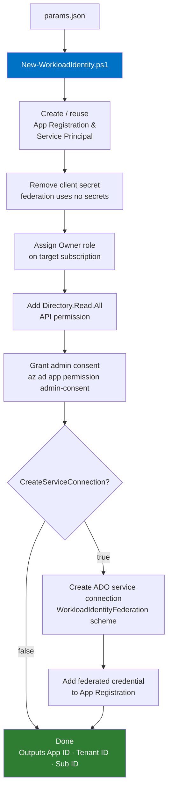

# azure-workload-identity

PowerShell automation for creating Entra ID app registrations with workload identity federation, intended for use as Azure DevOps service connections.

## Overview

Workload identity federation lets Azure DevOps pipelines authenticate to Azure without client secrets — the pipeline exchanges a short-lived OIDC token for an Azure access token using a federated credential on the app registration. This repo automates the full setup end-to-end.



## Prerequisites

- PowerShell 7+
- Az PowerShell module: `Install-Module Az`
- Azure CLI: required for the admin consent step
- An active Az context: `Connect-AzAccount`
- **For service connection creation:** Project Collection Administrator in the target ADO org

## Usage

1. Copy `config/example.json` and populate your subscriptions:

```json
[
    {
        "SubscriptionName": "sub-prod-myapp-01",
        "CreateServiceConnection": "true",
        "OrgName": "my-ado-org",
        "ProjectName": "My Project"
    }
]
```

2. Run the script:

```powershell
.\New-WorkloadIdentity.ps1 -ParamsFile 'config\my-params.json'
```

Add `-Verbose` to see each step as it runs.

## Parameters file schema

| Field | Required | Description |
|---|---|---|
| `SubscriptionName` | Yes | Display name of the Azure subscription |
| `CreateServiceConnection` | Yes | `"true"` or `"false"` — whether to create an ADO service connection |
| `OrgName` | If `CreateServiceConnection=true` | ADO organisation name (from `dev.azure.com/<OrgName>`) |
| `ProjectName` | If `CreateServiceConnection=true` | ADO project name |

Multiple entries are supported — one app registration and service connection is created per entry.

## What gets created

For each entry in the params file:

| Resource | Name pattern | Notes |
|---|---|---|
| App registration & service principal | `app-<SubscriptionName>-devops` | Reused if it already exists |
| Role assignment | Owner on `/subscriptions/<id>` | Skipped if already assigned |
| API permission | `Directory.Read.All` (Graph) | Required for Entra ID group resolution |
| ADO service connection | `conn-app-<SubscriptionName>-devops` | Subscription or management group scope |
| Federated credential | `AzureDevOps` | Wired to the service connection issuer |

## Modules

### `modules/Authentication.ps1`

| Function | Description |
|---|---|
| `Get-AzDevOpsAccessToken` | Returns a bearer token scoped to the Azure DevOps REST API |
| `Set-AzureAuthentication` | Interactive context check — prompts to re-authenticate if context doesn't match expected values. For interactive use only. |

### `modules/Service-Connection.ps1`

| Function | Description |
|---|---|
| `New-AzDevOpsAzureSubscriptionServiceConnection` | Creates a service connection scoped to a subscription |
| `New-AzDevOpsAzureManagementGroupServiceConnection` | Creates a service connection scoped to a management group |
| `Get-AzDevOpsAzureServiceConnection` | Retrieves a service connection by ID (used internally to read the federation issuer) |

## CI

Pull requests are linted with [PSScriptAnalyzer](https://github.com/PowerShell/PSScriptAnalyzer) via GitHub Actions — see `.github/workflows/lint.yml`.
